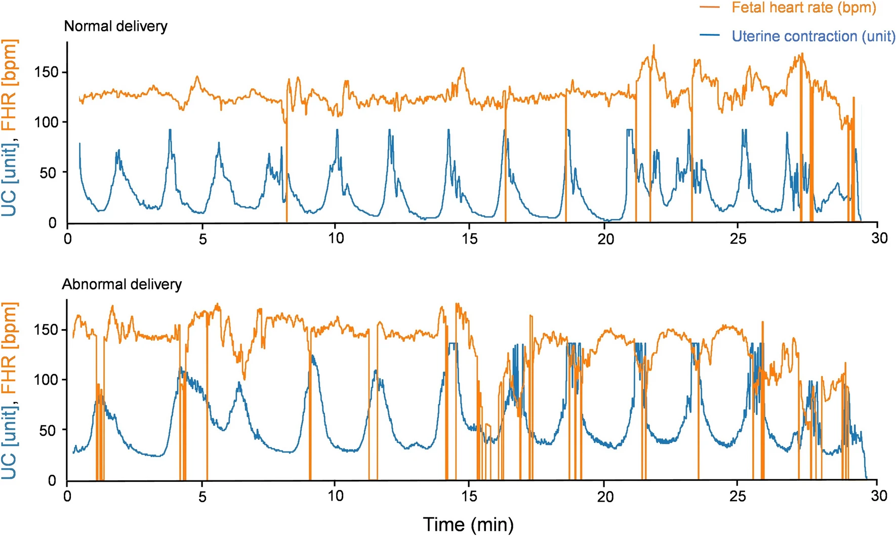
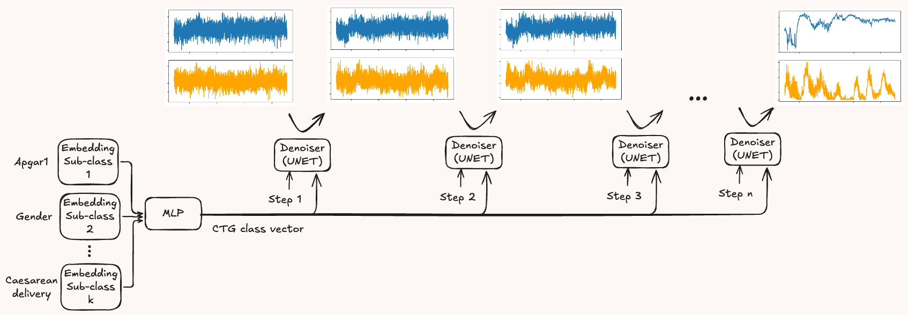
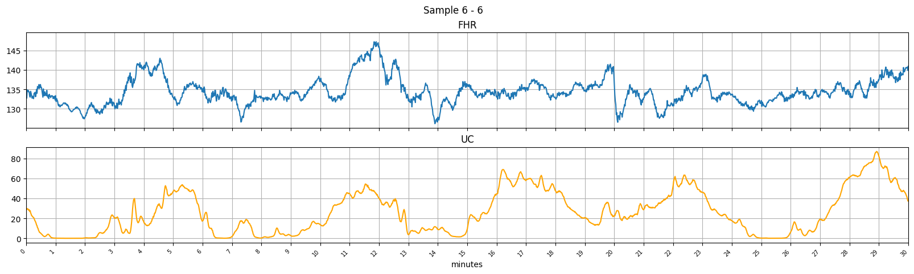
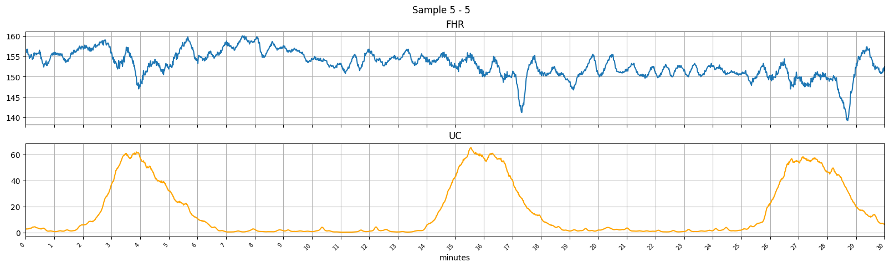

# Cardiotocography Data Generation with Diffusion Models

While this framework is designed as a diffusion-based CTG (Cardiotocography) data generator, it is general-purpose and can be applied to any type of time series data. 

## What is CTG?

CTG (Cardiotocography) is a medical monitoring technique used during pregnancy and childbirth to assess fetal well-being and uterine activity. It records two time series:
* **Fetal Heart Rate (FHR)**: This measures the heart rate of the fetus over time.
* **Uterine Contractions (UC)**: This measures the intensity and timing of uterine contractions.



CTG is used to [detect signs of fetal distress](https://geekymedics.com/how-to-read-a-ctg/), such as a lack of oxygen (fetal hypoxia), by observing patterns in the fetal heart rate in response to uterine contractions. This information helps healthcare providers make critical decisions about the need for interventions, such as inducing labor or performing a cesarean section.

## Why generating synthetic CTG?
There are several **potential** use cases:

* *Data Augmentation*: Synthetic data can potentially improve the training of CTG classification models by providing diverse samples. For example, abnormal CTGs are often less common than normal ones. Synthetic data can help balance datasets to improve machine learning model performance.
* *Training Human Experts*: Gynecologists and other healthcare professionals can use synthetic CTG data for educational purposes.
* *Addressing Privacy and Ethical Issues*: 
If CTG data is combined with external databases or meta-information (e.g., hospital admission logs, timestamps, or demographic data), it could potentially re-identify the mother or baby. In that case, CTG is subject to privacy regulations like GDPR, HIPAA, and the EU AI Act. Furthermore, CTG can potentially reveal sensitive information about both the mother and baby, such as maternal health conditions (e.g., diabetes, preeclampsia), the baby’s gender, or lifestyle factors like smoking or substance use inferred from fetal heart rate variability. When combined with external data, CTG might also uncover genetic predispositions or sensitive family health information, raising privacy concerns **not** only for the mother and child.


## Overview 

[Diffusion models](https://arxiv.org/abs/2406.08929) use a denoiser, typically a [UNET](https://arxiv.org/pdf/1611.07004), to turn pure Gaussian noise into a realistic CTG sample. The denoiser predicts and removes noise from its input. Training involves adding noise to a CTG sample and feeding this noisy version into the UNET, while the original clean sample serves as the target. Since removing all noise in one step would be very hard, diffusion models break the process into smaller steps, gradually refining the output. A single denoiser model handles every step, with the step number included as an additional input.

Fetal heart rate (FHR) and uterine contractions (UC) correspond to distinct input channels. Both channels have the same number of measurements. 
Due to the strong local spatial correlation often present in time-series data, the convolutional network-based UNET architecture typically used for images can be adapted for CTG data with minor adjustments. Instead of the usual 3 channels (e.g., RGB for images), CTG has 2 channels (one for FHR and one for UC), each containing a vector of measurements. As a result, 1D convolutions are used instead of 2D convolutions, but the overall model architecture remains largely unchanged.

Conditional generation is supported by classifier-free guidance. Each sample can belong to multiple subclasses (e.g., delivery type, Apgar scores, mother’s age, baby’s gender). These subclasses are discretized into categories (see `generate_labels.ipynb`). Each subclass is embedded separately and combined into a single vector, which is then input to the UNET for denoising.


<p align="center">
  
  <i>CTG Diffusion</i>
</p>

## Generation Methods
The framework supports a variety of generation strategies — from traditional denoising diffusion in the time domain to more advanced latent-based generation with super-resolution.
Each generation method is defined by combining three core components in the configuration file, making the framework modular and extensible:
1. **Compression Technique** (`first_stage_model` section): This component defines how the time series is encoded into a latent space. 
2.	**Denoising Diffusion** (`ldm` section): This is the generative model that operates in the output space of the compression model. By working in the latent domain, it allows efficient and scalable generation, even for high-resolution time series.
3.	**Super-Resolution** (`sr_model` section):
Super-resolution is applied after generation to refine or upscale the output. It has its own compression model (`first_stage_model` subsection).

Here are a few instantiations:

### Diffusion in Time Domain
[Standard denoising diffusion in the time domain](https://arxiv.org/abs/2006.11239) can be enabled by setting the `first_stage_model` to `identity`. This means the input time series is not compressed and the diffusion model operates directly on the raw time-domain data.

This approach is simple and effective for generating shorter time series or those with lower sampling frequency. However, since it does not leverage latent representations, it may become less scalable for longer or high-resolution sequences.

See ``configs/diffusion-identity.yaml`` for an example.

### Diffusion in Undersampled Time Domain
You can enable denoising diffusion in an undersampled time domain by setting the `first_stage_model` to `sampling` and specifying a `sampling_rate`. For example, a `sampling_rate` of 8 means every 8th sample is retained from the input sequence, effectively downsampling the data. The diffusion model then operates on this lower-resolution signal. After generation, the time series is upscaled back to the original resolution using simple linear interpolation.

This is the fastest and simplest method to make diffusion scalable for long time series. It does not require training a first-stage model, making it lightweight and efficient. However, its effectiveness depends on the assumption that the time series is redundant, such that downsampling introduces minimal distortion. 

See ``sampling-diffusion`` for an example.

### Compression with Learned Representations

CTGs show high local spatial correlation, which makes them highly compressible.
Time series data can be effectively compressed using data-dependent models such as VAE (Variational Autoencoder), VQ-VAE (Vector Quantized VAE), or VQ-GAN (Vector Quantized GAN). These approaches learn to represent the data in a compact latent space which allows higher compression ratios, more accurate reconstructions compared to naive downsampling, and richer feature representations via the encoder, which can be useful for downstream tasks.
While these models are capable of generating time series directly from latent codes, this functionality is not currently supported by this framework.


 The encoder architecture is similar to the encoder part of the U-NET.


The decoder architecture is the inverse of the encoder architecture.

See ``{vqvae,vae}-only.yaml`` for an example.

### Latent Diffusion 

Similarly to [Stable Diffusion](https://arxiv.org/pdf/2112.10752), this approach generates data directly in the latent space of the first stage model, making the process faster than synthesizing CTGs directly in the time domain. 

<p align="center">
  
  <i>Generated with Latent Diffusion</i>
</p>

A first stage model such as [VQVAE](https://arxiv.org/abs/1711.00937) or [VQGAN](https://arxiv.org/pdf/2012.09841) is trained to encode the time-series data into a more compact latent representation. A diffusion model is then trained on the latent space created by the first-stage model to generate synthetic latent representation. Finally, this synthetic latent representation is transformed by the decoder of the first stage model into the time domain.
Since the latent representation is a compressed version of the original data, its generation becomes significantly faster.

See ``diffusion-vqvae.yaml`` for an example with VQ-VAE as the first stage model.

### Diffusion on Undersampled Data + Latent-based Super-resolution

This is a two-stage generation pipeline:

1. **Low-Resolution Generation:** First, a standard denoising diffusion model operates directly in the time domain to generate a low-resolution (undersampled) version of the target time series. This step captures the global trends and structure of the signal while intentionally ignoring finer, noisier details.

2. **Latent-Based Super-Resolution:** Next, a latent diffusion model upsamples the low-resolution output into a high-resolution version using a learned latent space, inspired by [VQ-VAE-2](https://arxiv.org/pdf/1906.00446) and a [latent-based super-resolution technique](https://arxiv.org/pdf/2112.10752). This process works as follows:
A latent representation of the high-resolution signal, denoted as $z_{hr}$, is generated using conditional diffusion, where the condition is the latent code $z_{lr}$ corresponding to the interpolated low-resolution signal produced in the first stage.
Specifically, $z_{hr}$ is sampled by a diffusion model that takes as input the concatenation of $z_{lr}$ and Gaussian noise along the channel dimension. This conditioning setup guides the model to generate fine-grained details consistent with the global structure captured in the low-resolution signal.
Finally, the high-resolution latent $z_{hr}$ is decoded using a VQ-VAE decoder to reconstruct the full-resolution time series.

This approach balances scalability and fidelity by generating coarse structures first, then refining them with fine-grained detail in a second, latent-driven step. Hence, it requires two low-resolution generations (one for $z_{lr}$ and another for $z_{hr}$).

See ``sampling-diffusion-sr_vqvae.yaml`` for an example. `sr_model` specifies super resolution with its own `first_stage_model`. Although `first_stage_model` can be set to identity for traditional super resolution, it can be signficantly slower for high-resolution time series.


<p align="center">
  
  <i>Generated with Super-Resolution</i>
</p>

### Configuration


#### General settings:
- **`in_channels`**: Number of time-series inputs (e.g., `2` for CTG).  
- **`freq`**: Sampling frequency of the original data.  
- **`input_size`**: Length of the original time-series.  
- **`training_data`**: pytables (h5) file containing the pre-processed training data and the patient ID per training sample (see below for the details).
- **`out_dir`**: the output directory of the training process containing the trained models and visualized samples.
- **`class_file`**: Specifies the classes for each training sample in CSV format. The first column is the patient ID also present in the pytables file for each training sample.
If `class_file` is omitted, unconditional generation is used.  
- **`classes`**: Lists the specific classes used for generation. 
 


#### First-stage model:
The `first_stage_model` section can define `identity` (no compression), `vqvae` (VQ-VAE), `vae` (VAE), `vqgan` (VQ-GAN).

For `vqvae`, `vae`, `vqgan`:
- **Latent Dimensions**: Typically small (2–4).  
- **Layers**: Limited (2–3) but with a higher number of convolutional filters to retain local variations. The numbers given in `channel_mults` are the channel multipliers (this number of times 32 is the actual channel number). For example, if`channel_mults` is 2,4,8, then we have three layers with 64, 128, 256 channels per layer (last one is the output layer).

- **Reconstruction Loss**: Uses an adjusted version of ["focal" frequency loss](https://github.com/EndlessSora/focal-frequency-loss), with normalization applied separately for each channel to handle different scales and semantics.  This loss helps preserve high-frequency components unlike more standard $L_p$ losses.

#### LDM:
The `ldm` section specifies the Latent Diffusion model configuration including the denoiser's U-NET architecture (`channel_mults`), and the beta scheduling method (linear or cosine) in `schedule_opt` with the number of diffusion steps (`n_timestep`). The learning rate scheduler is `ReduceLROnPlateau` which reduced learning rate by a factor when training loss as stopped improving.

#### Super-resolution:
Same as for LDM except that it has its own first stage model section which can be `vqvae`, `vae` for latent-based super-resolution or `identity` for super-resolution in time domain.

## Training

### Generate training data

Generate training data into pytables:
```
python -m tools.generate_training_data
```
Each patient’s CTG data must be stored in separate CSV files, with the filename serving as the unique patient ID (see [this](https://github.com/anantgupta129/CTU-CHB-Intrapartum-Cardiotocography-Caesarean-Section-Prediction/tree/main/database) for an example). The training data is generated as follows:
1.	The CTG is segmented where the FHR remains constantly zero for more than `max_break_sec` seconds.
2.	Training samples are extracted from these segments using a sliding window. The window spans `min_ts_length_min` minutes of data and shifts by `stride_sec` seconds. Each window produces a training sample.

Finally, the data is scaled to the range [-1,1], which is the expected input format for all models. This is done using linear min-max scaling, with the required max-min values stored in the configuration file. The scaled data is then stored in PyTables with the shape `(train_sample_num, min_ts_length_min, channel_num)`. Additionally, the corresponding patient IDs for each training sample are stored in a separate array within the same PyTables file.

For conditional generation, each training sample’s labels are stored in a single CSV file. The first column contains the patient ID, linking each label (row) to its corresponding training samples. This linking is performed on-the-fly in `dataloader/loader.py`. An example of label generation can be found in `tools/generate_labels.py`.

### Run training
Provide the configuration file in command line which contains all training parameters:
```
accelerate launch train.py --config=configs/diffusion-identity-czech.yaml
```
At the end of every epoch, the models are saved and the a few generated samples are saved for visualization in the output directory specified in the config file. 
`configs/vqvae-czech.yaml` is an example for Method 1 (see above), while `configs/sampling-czech.yaml` is for Method 2.

## Generation
Generate 100 samples into a h5 file using ddim sampler with 100 steps:
```
python generate.py --config=configs/diffusion-identity-czech.yaml --out_dir=output/diffusion-identity-czech --samples=100 --steps=400 --sampler=ddim --guidance_scale=8 --out_h5=generated_samples.h5
```
Generation is done with classifier-free guidance, with all necessary information (such as model paths) retrieved from the configuration file. 
If `--samples` is set to a csv file name, then all columns except the last define the label (subclass items) and the last `count` column specifies the number of samples to generate for that label.
For reference, see `sample_classes.csv`. If `--samples` is a number, labels are randomly generated based on the training distribution, and then CTGs are generated accordingly using the sampled labels.

Sample outputs are visualized in the specified output directory (`--out_dir`).
A variety of samplers are supported, including the default DDPM (with fixed timesteps), as well as DDIM, PLMS, dpm_solver and multiple ksamplers from [k-diffusion](https://github.com/crowsonkb/k-diffusion/tree/master) for variable timestep control. 

## Evaluation
Evaluation is performed using Fréchet Inception Distance (FID) and Inception Score (IS), both of which require a trained classifier to extract features from time-series data. A fully convolutional network (FCN) from [this repository](https://github.com/okrasolar/pytorch-timeseries) is used for this purpose. A separate classifier is trained for each subclass, and the average performance metrics—FID, IS, and test accuracy—are reported.

Configure evaluation in `configs/czech-eval.yaml` that specifies:
- The path to the generative model and the original samples
- The path to the PyTables file containing generated samples
- The path to the trained classifiers

Steps to Run Evaluation:
1. Train the feature extractors:
``` 
python -m evaluation.train_fcn --config=configs/czech-eval.yaml
```
2. Compute the average FID and IS scores, along with classifier accuracy:
```
python eval.py --config=configs/czech-eval.yaml
```

## Privacy issues 

Membership inference attacks (MIA) are commonly used to evaluate the risk of information leakage from trained generative models or their outputs. The goal of MIA is to determine whether a given sample was part of the model’s training data, which is a binary classification task.

We [implemented LiRA (Likelihood Ratio Test)](https://github.com/endreglocker/Privacy-Analysis-of-Diffusion-based-Generative-Machine-Learning-Models) as an MIA against a trained generative model on the public Czech dataset. The attack achieved an accuracy of 70-80%, indicating that the model does leak some information. The effectiveness of a more restricted black-box attacker—who only has access to the generated synthetic data—has not been assessed.
[Differentially Private (DP) training](https://github.com/pytorch/opacus) can help mitigate these risks at the cost of data fidelity. 

## Thanks to
- Diffusion: 
    * https://github.com/lucidrains/denoising-diffusion-pytorch/blob/main/denoising_diffusion_pytorch/denoising_diffusion_pytorch_1d.py
    * https://github.com/joh-schb/PlantLDM
    * https://github.com/Stability-AI/stablediffusion
    * https://github.com/crowsonkb/k-diffusion
- Evaluation: 
    * https://github.com/danelee2601/supervised-FCN-2/tree/main
- Focal Frequency Loss:
    * https://github.com/EndlessSora/focal-frequency-loss
- Processed CTG:
    * https://github.com/anantgupta129/CTU-CHB-Intrapartum-Cardiotocography-Caesarean-Section-Prediction/tree/main