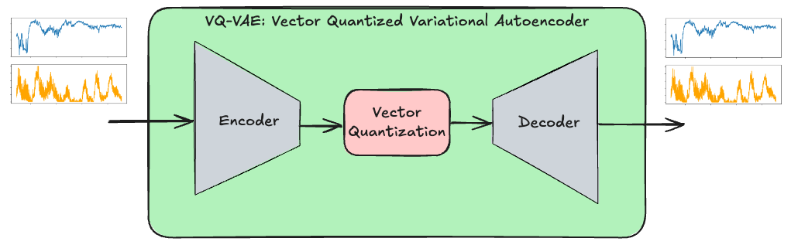
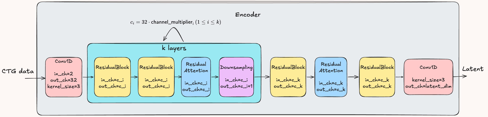

# A Diffusion-based Cardiotocography Data Generator

## What is CTG?

CTG (Cardiotocography) is a medical monitoring technique used during pregnancy and childbirth to assess fetal well-being and uterine activity. It records two time series:
* **Fetal Heart Rate (FHR)**: This measures the heart rate of the fetus over time.
* **Uterine Contractions (UC)**: This measures the intensity and timing of uterine contractions.


CTG is used to [detect signs of fetal distress](https://geekymedics.com/how-to-read-a-ctg/), such as a lack of oxygen (fetal hypoxia), by observing patterns in the fetal heart rate in response to uterine contractions. This information helps healthcare providers make critical decisions about the need for interventions, such as inducing labor or performing a cesarean section.

## Why generating synthetic CTG?
There are several **potential** use cases:

* *Data Augmentation*: Synthetic data can potentially improve the training of CTG classification models by providing diverse samples. For example, abnormal CTGs are often less common than normal ones. Synthetic data can help balance datasets to improve machine learning model performance.
* *Training Human Experts*: Gynecologists and other healthcare professionals can use synthetic CTG data for educational purposes.
* *Addressing Privacy and Ethical Issues*: 
If CTG data is combined with external databases or meta-information (e.g., hospital admission logs, timestamps, or demographic data), it could potentially re-identify the mother or baby. In that case, CTG is subject to privacy regulations like GDPR, HIPAA, and the EU AI Act. Furthermore, CTG can potentially reveal sensitive information about both the mother and baby, such as maternal health conditions (e.g., diabetes, preeclampsia), the baby’s gender, or lifestyle factors like smoking or substance use inferred from fetal heart rate variability. When combined with external data, CTG might also uncover genetic predispositions or sensitive family health information, raising privacy concerns **not** only for the mother and child.


## Overview 

[Diffusion models](https://arxiv.org/abs/2406.08929) use a denoiser, typically a [UNET](https://arxiv.org/pdf/1611.07004), to turn pure Gaussian noise into a realistic CTG sample. The denoiser predicts and removes noise from its input. Training involves adding noise to a CTG sample and feeding this noisy version into the UNET, while the original clean sample serves as the target. Since removing all noise in one step would be very hard, diffusion models break the process into smaller steps, gradually refining the output. A single denoiser model handles every step, with the step number included as an additional input.

Fetal heart rate (FHR) and uterine contractions (UC) correspond to distinct input channels. Both channels have the same number of measurements. 
Due to the strong local spatial correlation often present in time-series data, the convolutional network-based UNET architecture typically used for images can be adapted for CTG data with minor adjustments. Instead of the usual 3 channels (e.g., RGB for images), CTG has 2 channels (one for FHR and one for UC), each containing a vector of measurements. As a result, 1D convolutions are used instead of 2D convolutions, but the overall model architecture remains largely unchanged.

Conditional generation is supported by classifier-free guidance. Each sample can belong to multiple subclasses (e.g., delivery type, Apgar scores, mother’s age, baby’s gender). These subclasses are discretized into categories (see `generate_labels.ipynb`). Each subclass is embedded separately and combined into a single vector, which is then input to the UNET for denoising.


<p align="center">
  
  <i>CTG Diffusion</i>
</p>

## Generation Methods

1.	**Latent Diffusion with a Vector Quantized Variational Autoencoder (VQ-VAE)**: Similarly to [Stable Diffusion](https://arxiv.org/pdf/2112.10752), this approach generates data directly in the latent space of VAE, making the process faster than synthesizing CTGs directly in the time domain. CTGs show high local spatial correlation, which makes them highly compressible. 

<p align="center">
  
  <i>Generated with Latent Diffusion</i>
</p>

2.	**Diffusion with Super-Resolution**: This method first generates a low-resolution (under-sampled) version of the CTG using [standard denoising diffusion in the time domain](https://arxiv.org/abs/2006.11239), and then applies a [latent-based super-resolution technique](https://arxiv.org/pdf/2112.10752) to upscale it. The latent-based super-resolution works by first creating a latent representation of the high-resolution CTG through [conditional diffusion](https://arxiv.org/pdf/2104.07636), where the condition is the interpolated version of the low-resolution CTG. This generated latent representation is then decoded into its high-resolution form. 

<p align="center">
  
  <i>Generated with Super-Resolution</i>
</p>

### Method 1: Latent Diffusion
A first stage model such as [VQVAE](https://arxiv.org/abs/1711.00937) or [VQGAN](https://arxiv.org/pdf/2012.09841) is trained to encode the time-series data into a more compact latent representation. A diffusion model is then trained on the latent space created by the first-stage model to generate synthetic latent representation. Finally, this synthetic latent representation is transformed by the decoder of the first stage model into the time domain.
Since the latent representation is a compressed version of the original data, its generation becomes significantly faster.



 The encoder architecture is similar to the encoder part of the U-NET.



The decoder architecture is the inverse of the encoder architecture.

#### Configuration

##### Time-Series Parameters:
- **`in_channels`**: Number of time-series inputs (e.g., `2` for CTG).  
- **`freq`**: Sampling frequency of the original data.  
- **`input_size`**: Length of the original time-series.  
- **`training_data`**: pytables (h5) file containing the pre-processed training data and the patient ID per training sample (see below for the details).
- **`out_dir`**: the output directory of the training process containing the trained models and visualized samples.
- **`class_file`**: Specifies the classes for each training sample in CSV format. The first column is the patient ID also present in the pytables file for each training sample.
If `class_file` is omitted, unconditional generation is used.  
- **`classes`**: Lists the specific classes used for generation.  

##### First-Stage Model (VQVAE):
The `first_stage_model` section defines the VQVAE configuration, including:  
- **Latent Dimensions**: Typically small (2–4).  
- **Layers**: Limited (2–3) but with a higher number of convolutional filters to retain local variations. The numbers given in `channel_mults` are the channel multipliers (this number of times 32 is the actual channel number). For example, if`channel_mults` is 2,4,8, then we have three layers with 64, 128, 256 channels per layer (last one is the output layer).

- **Reconstruction Loss**: Uses an adjusted version of ["focal" frequency loss](https://github.com/EndlessSora/focal-frequency-loss), with normalization applied separately for each channel to handle different scales and semantics.  This loss helps preserve high-frequency components unlike more standard $L_p$ losses.

##### Latent Diffusion Model (LDM):
The `ldm` section specifies the Latent Diffusion model configuration including the denoiser's U-NET architecture (`channel_mults`), and the beta scheduling method (linear or cosine) in `schedule_opt` with the number of diffusion steps (`n_timestep`).

### Method 2: Diffusion with Super-Resolution
The process has two stages. First, a diffusion model generates a low-resolution version of the synthetic sample. Then, latent diffusion upscales it to high resolution.

To train the low-resolution diffusion model, the training data is undersampled, for example, by a factor of 8. A standard diffusion model generates this lower-resolution data in the time domain, capturing the global trends of the time series while disregarding finer, noisier details. These finer details are handled separately by a conditional latent diffusion model, which upscales the undersampled data similarly to [VQ-VAE-2](https://arxiv.org/pdf/1906.00446). It generates a high-resolution latent representation by conditioning on the low-resolution latent $z_{lr}$, achieved by concatenating noise with $z_{lr}$ along the channel dimension (after interpolation). The generated latent code is then decoded into high resolution using VQVAE.

This method provides a mid-solution between Method 1 (Latent Diffusion) and training a single high-resolution diffusion model entirely in the time domain. Even if the latent representation lacks full fidelity, the low-resolution diffusion model still preserves the main trends while offering greater scalability than a single high-resolution model trained end-to-end. Indeed, the complete diffusion process happens at a lower resolution, 
with upscaling performed just once, at the very end, through the decoder. 

#### Configuration

Time-series characteristics and classes are defined the same way as in Method 1. The `first_stage_model` section in the root configuration sets the sampling rate. The super-resolution model, defined under `sr_model`, has its own first-stage model where diffusion is conditioned on the low-resolution time series, followed by the final upscaling into the high-resolution regime.

## Training

### Generate training data

Generate training data into pytables:
```
python -m tools.generate_training_data
```
Each patient’s CTG data must be stored in separate CSV files, with the filename serving as the unique patient ID (see [this](https://github.com/anantgupta129/CTU-CHB-Intrapartum-Cardiotocography-Caesarean-Section-Prediction/tree/main/database) for an example). The training data is generated as follows:
1.	The CTG is segmented where the FHR remains constantly zero for more than `max_break_sec` seconds.
2.	Training samples are extracted from these segments using a sliding window. The window spans `min_ts_length_min` minutes of data and shifts by `stride_sec` seconds. Each window produces a training sample.

Finally, the data is scaled to the range [-1,1], which is the expected input format for all models. This is done using linear min-max scaling, with the required max-min values stored in the configuration file. The scaled data is then stored in PyTables with the shape `(train_sample_num, min_ts_length_min, channel_num)`. Additionally, the corresponding patient IDs for each training sample are stored in a separate array within the same PyTables file.

For conditional generation, each training sample’s labels are stored in a single CSV file. The first column contains the patient ID, linking each label (row) to its corresponding training samples. This linking is performed on-the-fly in `dataloader/loader.py`. An example of label generation can be found in `tools/generate_labels.py`.

### Run training
Provide the configuration file in command line which contains all training parameters:
```
accelerate launch train.py --config=configs/sampling.yaml
```
At the end of every epoch, the models are saved and the a few generated samples are saved for visualization in the output directory specified in the config file. 
`configs/vqvae-czech.yaml` is an example for Method 1 (see above), while `configs/sampling-czech.yaml` is for Method 2.

## Generation
Generate 100 samples into a h5 file using ddim sampler with 100 steps:
```
python generate_samples.py --config=configs/vqvae_czech.py --out_dir=output/vqvae-czech --samples=100 --steps=100 --sampler=ddim --cond_scale=1 --out_h5=generated_samples.h5
```
Generation is done with classifier-free guidance, with all necessary information (such as model paths) retrieved from the configuration file. 
If `--samples` is set to a csv file name, then all columns except the last define the label (subclass items) and the last `count` column specifies the number of samples to generate for that label.
For reference, see `sample_classes.csv`. If `--samples` is a number, labels are randomly generated based on the training distribution, and then CTGs are generated accordingly using the sampled labels.

Sample outputs are visualized in the specified output directory (`--out_dir`).
A variety of samplers are supported, including the default DDPM (with fixed timesteps), as well as DDIM, PLMS, dpm_solver and multiple ksamplers from [k-diffusion](https://github.com/crowsonkb/k-diffusion/tree/master) for variable timestep control. 

## Evaluation
Evaluation is performed using Fréchet Inception Distance (FID) and Inception Score (IS), both of which require a trained classifier to extract features from time-series data. A fully convolutional network (FCN) from [this repository](https://github.com/okrasolar/pytorch-timeseries) is used for this purpose. A separate classifier is trained for each subclass, and the average performance metrics—FID, IS, and test accuracy—are reported.

Configure evaluation in `configs/eval.yaml` that specifies:
- The path to the generative model and the original samples
- The path to the PyTables file containing generated samples
- The path to the trained classifiers

Steps to Run Evaluation:
1. Train the feature extractors:
``` 
python -m evaluation.train_fcn --config=configs/eval.yaml
```
2. Compute the average FID and IS scores, along with classifier accuracy:
```
python eval.py --config=configs/eval.yaml
```

## Privacy issues 

Membership inference attacks (MIA) are commonly used to evaluate the risk of information leakage from trained generative models or their outputs. The goal of MIA is to determine whether a given sample was part of the model’s training data, which is a binary classification task.

We [implemented LiRA (Likelihood Ratio Test)](https://github.com/endreglocker/Privacy-Analysis-of-Diffusion-based-Generative-Machine-Learning-Models) as an MIA against a trained generative model on the public Czech dataset. The attack achieved an accuracy of 70-80%, indicating that the model does leak some information. The effectiveness of a more restricted black-box attacker—who only has access to the generated synthetic data—has not been assessed.
[Differentially Private (DP) training](https://github.com/pytorch/opacus) can help mitigate these risks at the cost of data fidelity. 

## Thanks to
- Diffusion: 
    * https://github.com/lucidrains/denoising-diffusion-pytorch/blob/main/denoising_diffusion_pytorch/denoising_diffusion_pytorch_1d.py
    * https://github.com/joh-schb/PlantLDM
    * https://github.com/Stability-AI/stablediffusion
    * https://github.com/crowsonkb/k-diffusion
- Evaluation: 
    * https://github.com/danelee2601/supervised-FCN-2/tree/main
- Focal Frequency Loss:
    * https://github.com/EndlessSora/focal-frequency-loss
- Processed CTG:
    * https://github.com/anantgupta129/CTU-CHB-Intrapartum-Cardiotocography-Caesarean-Section-Prediction/tree/main